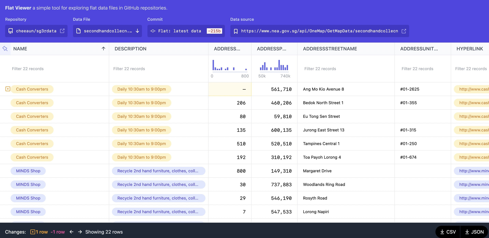
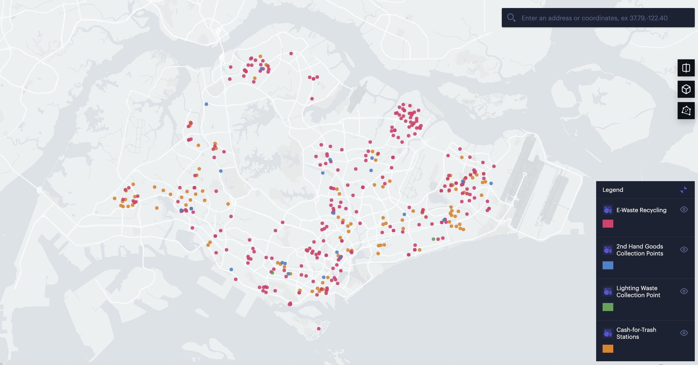

Singapore 3R data
===

This repository uses a Flat Data Action to fetch 4 datasets from https://www.nea.gov.sg/our-services/waste-management/3r-programmes-and-resources/recycling-collection-points

- 2nd Hand Goods Collection Points: `secondhandcollecn.json`
- Cash For Trash: `cashfortrash.json`
- E-waste Recycling: `ewaste.json`
- Lighting Waste Collection Points: `lighting.json`

Viewable on Flat Viewer: https://flatgithub.com/cheeaun/sg3rdata

Viewable on Unfolded: https://studio.unfolded.ai/public/19762bff-caec-4b80-bc1e-ab585f5c270a

These data are © [National Environment Agency](https://www.nea.gov.sg/open-data-licence).